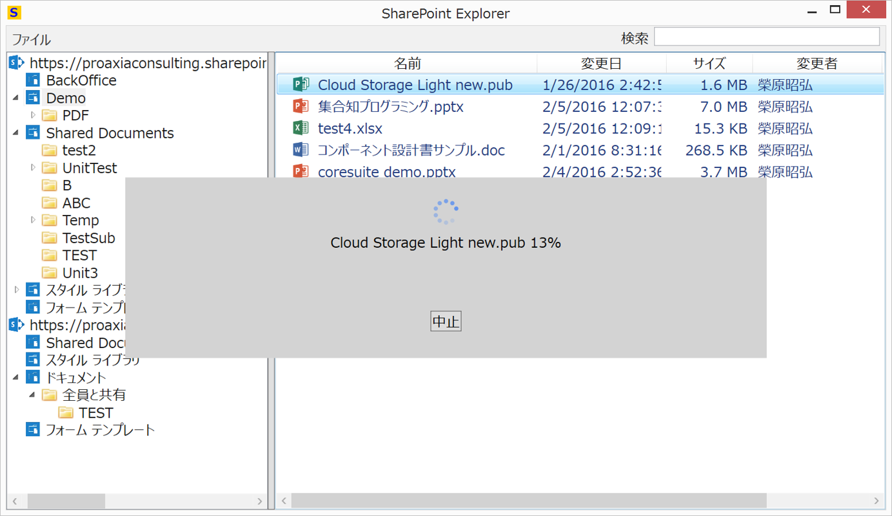

# sharepoint

SharePoint explorer

SharePoint Explorer is a Windows application to operate files on the SharePoint Online.

SharePointエクスプローラは、SharePoint Online上のファイルをエクスプローラ感覚で操作するWindowsアプリケーションです。

